# Boas-vindas ao repositório do projeto Conversor de Moedas

| 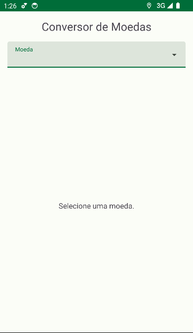 | 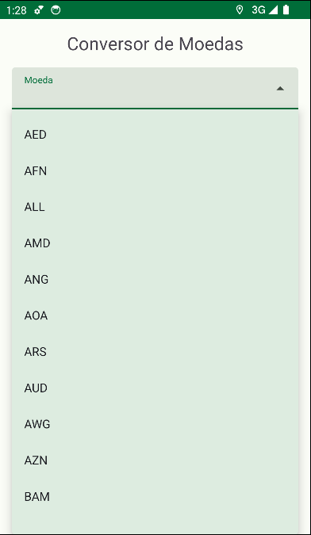 | 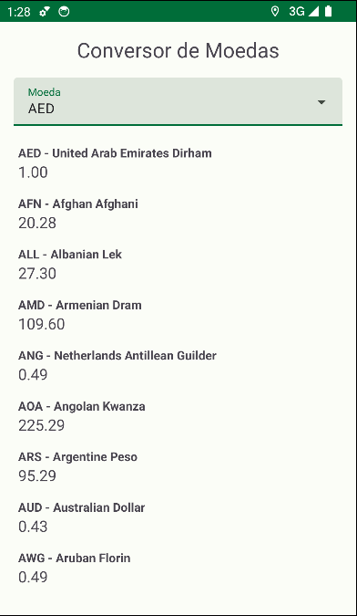 |
|:---:| :---: | :---: |

<br />

Para realizar o projeto, atente-se a cada passo descrito a seguir, e se tiver **qualquer dúvida**, nos envie no _Slack_ da turma! #vqv 🚀

Aqui, você vai encontrar os detalhes de como estruturar o desenvolvimento do seu projeto a partir desse repositório, utilizando uma branch específica e um _Pull Request_ para colocar seus códigos.

<br />

## Termos e acordos

Ao iniciar este projeto, você concorda com as diretrizes do [Código de Conduta e do Manual da Pessoa Estudante da Trybe](https://app.betrybe.com/learn/student-manual/codigo-de-conduta-da-pessoa-estudante).

<br />

## Entregáveis

<details><summary><strong>🤷🏽‍ Como entregar</strong></summary><br />

Para entregar o seu projeto, você deverá criar um _Pull Request_ neste repositório.

Lembre-se que você pode consultar nosso conteúdo sobre [Git & GitHub](https://app.betrybe.com/learn/course/5e938f69-6e32-43b3-9685-c936530fd326/module/f04cdb21-382e-4588-8950-3b1a29afd2dd/section/876a615b-f578-4d65-a820-de9f3e5e57db/lesson/be8632bf-7bb7-4c01-a5d9-7aadac3a58f0) sempre que precisar!
<br /></details>

<details><summary><strong>🧑‍💻 O que deverá ser desenvolvido</strong></summary><br />

Você será responsável por desenvolver uma aplicação Android de conversão de moedas que utiliza os dados da API [exchangerate.host](https://exchangerate.host). Esse aplicativo contêm o layout, a validação de estado dos compoentes e código de consumo de uma API Rest com Retrofit.

<br /></details>

<details><summary><strong>📝 Habilidades a serem trabalhadas </strong></summary><br />

Neste projeto, verificaremos se você é capaz de:

- Utilizar Kotlin para manipular os elementos visuais do Android;
- Utilizar Kotlin para desenvolver regras de negócio da interface;
- Construir layout via XML utilizando componentes do Material Design 3;
- Posicionar os elementos visuais com ViewGroup;
- Utilizar Retrofit para consumir APIs Rest;
- Utilizar Corotinas para realizar chamadas assíncronas.

<br /></details>


## Orientações

<details><summary><strong>‼ Antes de começar a desenvolver</strong></summary><br /> 

#### 1. Clone o repositório

- Use o comando: `git clone git@github.com:betrybe/android-001-projeto-android-cambio.git`

- Entre na pasta do repositório que você acabou de clonar:

    - `cd android-001-projeto-android-cambio`

#### 2. Instale as dependências

- Entre no arquivo `build.gradle` localizado dentro do diretório **app**

- Clique no botão `Sync Now` caso ele exista; se a opção não estiver disponível, significa que a sincronização automática já foi realizada ao abrir o Android Studio.

#### 3. Crie uma branch a partir da branch `main`

- Verifique que você está na branch `main`. Use o comando `git branch` para isso

- Se você não estiver, mude para a branch `main`. Use `git checkout main`

- Agora, crie uma branch à qual você vai submeter os `commits` do seu projeto.

    - Você deve criar uma branch no formato `{seu-nome-e-sobrenome}-{nome-do-projeto}`. Exemplo: `italo-moura-projeto-android-cambio`

    - Exemplo: `git checkout -b italo-moura-projeto-android-cambio`

#### 4. Adicione as mudanças ao _stage_ do Git e faça um `commit`

- Verifique que as mudanças ainda não estão no _stage_. O comando `git status` irá mostrar essa informação para você, mostrando os arquivos em vermelho

- Adicione o novo arquivo ao _stage_ do Git. Use `git add .` para adicionar **todos** os arquivos ao _stage_ ou `git add nome-do-arquivo` para adicionar um arquivo específico

- Verifique com o comando `git status` que os arquivos adicionados ao _stage_ agora estão verde

- Faça o `commit` inicial com o comando `git commit -m "Iniciando o projeto"`

- Verifique com `git status` que você não possui mais alterações para serem commitadas. A mensagem _nothing to commit_ ou similar deve aparecer

- Adicione a sua branch com o novo `commit` ao repositório remoto com o comando `git push`. Exemplo: `git push -u origin italo-moura-projeto-android-cambio`

#### 5. Crie um novo `Pull Request` _(PR)_

- Vá até a página de _Pull Requests_ do [repositório no GitHub](https://github.com/tryber/android-0x-projeto-conversor-moeda/pulls)

- Clique no botão verde _"New pull request"_

- Clique na caixa de seleção _"Compare"_ e escolha a sua branch **com atenção**

- Coloque um título para o seu _Pull Request_

- Exemplo: _"[Gabriel Oliva] Projeto Login Social"_

- Clique no botão verde _"Create pull request"_

- Adicione uma descrição para o _Pull Request_, um título nítido que o identifique, e clique no botão verde _"Create pull request"_

- Volte até a [página de _Pull Requests_ do repositório](https://github.com/tryber/android-0x-projeto-conversor-moeda/pulls) e confira se o seu _Pull Request_ está criado

<br /></details>

<details><summary><strong>⌨️ Durante o desenvolvimento</strong></summary><br />

Faça `commits` das alterações que você fizer no código regularmente, pois assim você garante visibilidade para o time da Trybe e treina essa prática para o mercado de trabalho. 😀

- Lembre-se de sempre após um (ou alguns) `commits` atualizar o repositório remoto

- Os comandos que você utilizará com mais frequência são:

    - `git status` _(para verificar o que está em vermelho - fora do stage - e o que está em verde - no stage)_;
    - `git add` _(para adicionar arquivos ao stage do Git)_;
    - `git commit` _(para criar um commit com os arquivos que estão no stage do Git)_;
    - `git push -u origin nome-da-branch` _(para enviar o commit para o repositório remoto na primeira vez que fizer o `push` de uma nova branch)_;
    - `git push` _(para enviar o commit para o repositório remoto após o passo anterior)_.

<br /></details>

<details><summary><strong>🎛 Linter</strong></summary><br />

Usaremos o [Ktlint](https://pinterest.github.io/ktlint/) para fazer o lint do seu código.

Este projeto já vem com as dependências relacionadas ao _linter_ configuradas no arquivo `build.gradle`, lembre-se de instalá-las.

Para poder rodar o `Ktlint` de forma local, rode o comando de acordo com o sistema operacional:

Mac ou Linux:
```bash
./gradlew ktlintCheck
```

Windows:
```bash
gradlew ktlintCheck
```

Se a análise do `Ktlint` encontrar problemas no seu código, tais problemas serão mostrados no seu terminal.

<br /></details>

<details><summary><strong>👀 Analisador estático de código</strong></summary><br />

Usaremos o [Detekt](https://detekt.dev/) para fazer a análise estática do seu código.

Este projeto já vem com as dependências relacionadas ao _linter_ configuradas no arquivo `build.gradle`, lembre-se de instalá-las.

Para poder rodar o `Detekt` de forma local, rode o comando de acordo com o sistema operacional:

Mac ou Linux:
```bash
./gradlew detekt
```

Windows:
```bash
gradlew detekt
```

Se a análise do `Ktlint` encontrar problemas no seu código, tais problemas serão mostrados no seu terminal.
</details>

<details>
<summary><strong>🛠 Testes</strong></summary><br />

Todos os requisitos do projeto serão testados automaticamente por meio do `Espresso`, uma ferramenta que testa interfaces. Você pode rodar o teste instrumentado no Android Studio ou via linha de comando.

#### Android Studio

Abra a aba `Run` e selecione o arquivo de teste, conforme exemplo abaixo:


#### Linha de comando

- Abra o emulador

- Execute o comando para os testes de Instrumentação
    - Mac ou Linux: `./gradlew connectedAndroidTest`
    - Windows: `gradlew connectedAndroidTest`

- Execute o comando para os testes Unitários
  - Mac ou Linux: `./gradlew testDebugUnitTest`
  - Windows: `gradlew testDebugUnitTest`

#### Avaliação

Os requisitos do seu projeto são avaliados automaticamente. Para verificar se a sua avaliação foi computada com sucesso, você pode verificar os **detalhes da execução do avaliador**:

- Na página do seu _Pull Request_, acima do "botão de merge", procure por `Evaluator job` e clique no link `Details`;

- Na página que se abrirá, procure pela linha `Evaluator step` e clique nela;

- Caso tenha dúvidas, peça ajuda no _Slack_.

⚠️ **O avaliador automático não necessariamente avalia seu projeto na ordem em que os requisitos aparecem no README. Isso acontece para deixar o processo de avaliação mais rápido. Então, não se assuste se isso acontecer, ok?**

O não cumprimento de um requisito, total ou parcialmente, impactará em sua avaliação.
<br /></details>

<details><summary><strong>✅ Avaliador Remoto</strong></summary> <br />

Para o avaliador remoto, estamos utilizando um dispositivo virtual com as seguintes configurações:

- API level: 29
- Display: 320x640
- DPI: 160x160
- Disable animations: true
- Disable spellchecker: false
- Disable Linux hardware acceleration: false
- Enable hardware keyboard: false

O projeto foi configurado para ser executado com versões específicas. Pode ocorrer que, ao baixar o projeto, o Android Studio sugira a atualização com a seguinte pergunta:

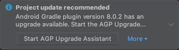

⚠️ Não atualize o projeto, pois pode não ser compatível com o avaliador remoto. ⚠️

<br /></details>

<details>
<summary><strong>🏗 Estrutura do projeto</strong></summary> <br />

O seu Pull Request deverá conter, obrigatoriamente, os arquivos `MainActivity.kt`, `ApiIdlingResource`, `ApiService`, `CurrencyRateResponse`, `CurrencySymbolResponse`  e `activity_main.xml`.

As imagens pedidas no projeto estão dentro da pasta _/res_.

⚠️ É importante que seus arquivos tenham exatamente estes nomes!

Caso sinta a necessidade de adicionar outros arquivos além destes, sinta-se à vontade.

<strong>API BACKEND</strong><br />

Neste projeto, estaremos utilizando a API chamada [Exchange Rates Data API](https://apilayer.com/marketplace/exchangerates_data-api). Para utilizar esta API, você precisará uttilizar está chave de acesso: `gKSrABlHD03DgJxz5bn3CKCC0XK4gY01`

Se necessário, a própria plataforma oferece informações sobre a API e documentação sobre como utilizá-la. <br />

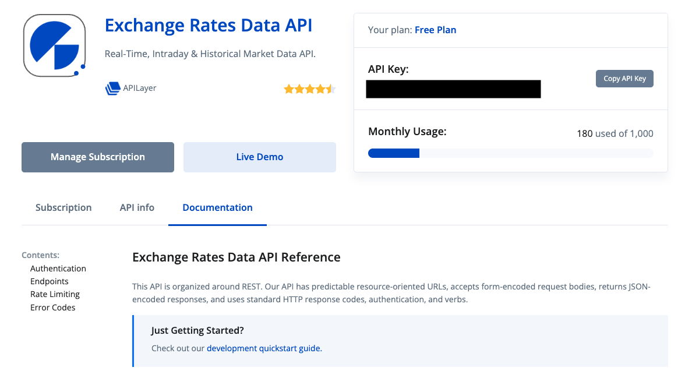

⚠️ É fundamental utilize a `API Key` em suas requisições para que possa ser avaliado no projeto. ⚠️


<br /></details>

# Requisitos do projeto

## `1 - Crie a estrutura inicial da tela com o nome da aplicação`

O aplicativo de conversão de moedas terá seu conteúdo principal dentro de um container, que será um LinearLayout. Nesse primeiro requisito vamos fazer a configuração inicial do container e inserir o primeiro elemento que ficará dentro dele: o texto com o nome da aplicação.

<details><summary><strong>️📱 Tela</strong></summary><br />

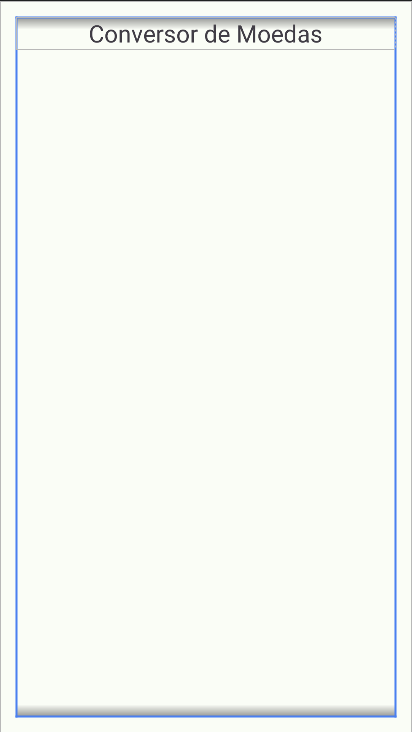

<br /></details>

<details><summary><strong>👩‍💻 Regras de implementação</strong></summary>

### Onde desenvolver

- O arquivo que você implementará o layout deve se chamar `activity_main.xml` e deve estar dentro do diretório `src/res/layout`;

### Estrutura da árvore de componentes da tela

```
App
└── ConstraintLayout
    └── LinearLayout
        └── MaterialTextView
```

### Regras de negócio

#### ConstraintLayout

- **Configuração**
    - Deve ser o elemento raíz da tela
    - Deve ter o id `main`
- **Layout**
    - Largura e altura devem ser a mesma do elemento pai

#### LinearLayout

- **Configuração**
    - Deve ser elemento filho do ConstraintLayout
    - Deve ter o id `linear_container`
    - Orientação deve ser `vertical`
- **Layout**
    - Largura e altura devem ser a mesma do elemento pai
    - As margens superior, inferior, esquerda e direita deve ser de `16dp`
- **Constraints**:
    - A constraint `top` deve ser ancorada no `top` do elemento pai
    - A constraint `bottom` deve ser ancorada no `bottom` do elemento pai
    - A constraint `right` deve ser ancorada no `right` do elemento pai
    - A constraint `left` deve ser ancorada no `left` do elemento pai

#### MaterialTextView

- **Configuração**
    - O elemento com o nome da aplicação deve ser o componente [MaterialTextView](https://developer.android.com/reference/com/google/android/material/textview/MaterialTextView)
    - Deve ser elemento filho do LinearLayout
    - Deve ter o id `application_name`
- **Layout**
    - Largura deve ser a mesma do elemento pai
    - Altura deve envolver o conteúdo
    - O conteúdo do componente deve estar centralizado
    - A margem inferior deve ser de `16dp`
- **Atributos**
  - O texto do componente deve ser `Conversor de Moedas`

### O que será testado?

- `ConstraintLayout`
  - O elemento `ConstraintLayout` está visível?
  - O elemento `ConstraintLayout` possui a mesma largura do pai?
  - O elemento `ConstraintLayout` possui a mesma altura do pai?
- `LinearLayout`
  - O elemento `LinearLayout` está visível?
  - O elemento `LinearLayout` é filho do elemento ConstraintLayout?
  - O elemento `LinearLayout` possui a mesma largura do elemento pai?
  - O elemento `LinearLayout` possui a mesma altura do elemento pai?
  - O elemento `LinearLayout` possui orientação vertical?
  - O elemento `LinearLayout` possui margens iguais a 16dp?
  - O elemento `LinearLayout` possui as restrições limitadas ao elemento pai?
- `MaterialTextView`
  - O elemento `MaterialTextView` está visível?
  - O elemento `MaterialTextView` é filho do elemento LinearLayout?
  - O elemento `MaterialTextView` possui o texto Conversor de Moedas?
  - O elemento `MaterialTextView` possui a mesma largura do elemento pai?
  - O elemento `MaterialTextView` possui a largura necessária para envolver seu conteúdo?
  - O elemento `MaterialTextView` tem o conteúdo centralizado?
  - O elemento `MaterialTextView` possui margem inferior igual a 16dp?
  - O elemento `MaterialTextView` possui o texto igual a Conversor de Moedas?

<br/></details>

## `2 - Crie o componente de seleção de moedas`

Para conseguir identificar qual moeda deseja-se converter, a pessoa usuária precisa de um componente para selecionar a moeda base.

<details><summary><strong>️📱 Tela</strong></summary><br />

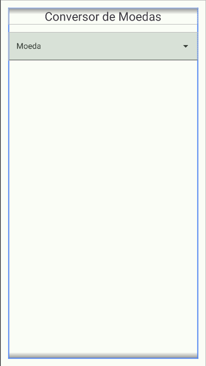

<br /></details>

<details><summary><strong>👩‍💻 Regras de implementação</strong></summary>

### Onde desenvolver

- O arquivo que você implementará o layout deve se chamar `activity_main.xml` e deve estar dentro do diretório `src/res/layout`;

### Estrutura da árvore de componentes da tela

```
App
└── ConstraintLayout
    └── LinearLayout
        ├── MaterialTextView
        └── TextInputLayout
            └── AutoCompleteTextView
```

### Regras de negócio

- O componente de seleção de moeda deve o componente `Menu` do [Material Design 3](https://m3.material.io/components/menus/overview)

#### TextInputLayout

- **Configuração**
  - Deve ser elemento filho do `LinearLayout`
  - Deve ter o id `currency_selection_input_container`
- **Layout**
  - Deve ter a mesma largura do elemento pai
  - Deve ter a altura necessária para envolver seu conteúdo
  - Deve ter margem inferior igual a 16dp
  - Deve ter um estilo definido com `ExposedDropdownMenu` do meterial3
- **Atributos**
  - Deve exibir a string `Moeda` como texto auxiliar (_hint_).

#### AutoCompleteTextView

- **Configuração**
  - Deve ser elemento filho do `TextInputLayout`
	- Deve ter o id `currency_selection_input_layout`
- **Layout**
  - Deve ter a mesma largura do elemento pai
  - Deve ter a altura necessária para envolver seu conteúdo
- **Atributos**
  - O tipo de entrada de texto (inputType) deve possuir o valor `none`

### O que será testado?

- `TextInputLayout`
  - O elemento `TextInputLayout` está visível?
  - O elemento `TextInputLayout` é filho do elemento LinearLayout?
  - O elemento `TextInputLayout` possui a mesma largura do elemento pai?
  - O elemento `TextInputLayout` possui a altura necessária para envolver seu conteúdo?
  - O elemento `TextInputLayout` possui margem inferior igual a 16dp?
  - O elemento `TextInputLayout` possui a label (hint) igual a Moeda?
- `AutoCompleteTextView`
  - O elemento `AutoCompleteTextView` está visível?
  - O elemento `AutoCompleteTextView` é filho do elemento TextInputLayout?
  - O elemento `AutoCompleteTextView` possui a mesma largura do elemento pai?
  - O elemento `AutoCompleteTextView` possui a altura necessária para envolver seu conteúdo?
  - O elemento `AutoCompleteTextView` possui inputType igual a none?

<br/></details>

## `3 - Crie o componente de estado Carregando Moedas`

Para informar a pessoa usuária do estado da aplicação está realizando o processo de carga das moedas, é necessário criar um componente que exiba essa informação.

<details><summary><strong>️📱 Tela</strong></summary><br />

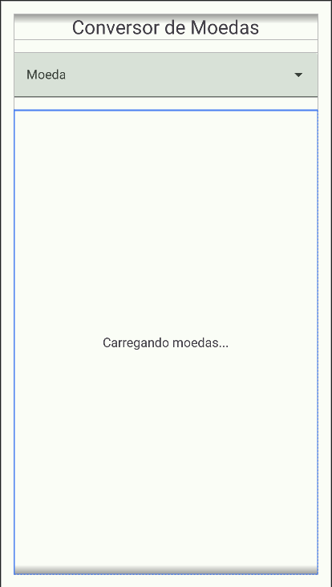

<br /></details>

<details><summary><strong>👩‍💻 Regras de implementação</strong></summary>

### Onde desenvolver

- O arquivo que você implementará o layout deve se chamar `activity_main.xml` e deve estar dentro do diretório `src/res/layout`;

### Estrutura da árvore de componentes da tela

```
App
└── ConstraintLayout
    └── LinearLayout
        ├── MaterialTextView
        ├── TextInputLayout
        │   └── AutoCompleteTextView
        └── MaterialTextView
```

### Regras de negócio

#### MaterialTextView

- **Configuração**
  - O elemento que exibirá o texto `Carregando moedas...` deve ser o componente [MaterialTextView](https://developer.android.com/reference/com/google/android/material/textview/MaterialTextView)
  - Deve ser elemento filho do LinearLayout
  - Deve ter o id `load_currency_state`
  - O componente de estado deve estar com a visibilidade como `gone`
- **Layout**
  - Largura deve ser a mesma do elemento pai
  - Altura deve ser a mesma do elemento pai
- **Atributos**
  - O texto do componente deve ser `Carregando moedas...`
  - O tamanho do texto deve ser de `16sp`
  - O conteúdo do componente deve estar centralizado

### O que será testado?

- O elemento `MaterialTextView` é filho do elemento LinearLayout?
- O elemento `MaterialTextView` possui a mesma largura do elemento pai?
- O elemento `MaterialTextView` possui a mesma altura do elemento pai?
- O elemento `MaterialTextView` tem o conteúdo centralizado?
- O elemento `MaterialTextView` possui o texto igual a Carregando Moedas...?
- O elemento `MaterialTextView` possui margem inferior igual a 16dp?

<br/></details>

## `4 - Crie o componente de estado Selecione uma Moeda`

Para informar a pessoa usuária do estado da aplicação está aguardando que ela selecione uma moeda, é necessário criar um componente que exiba essa informação.

<details><summary><strong>️📱 Tela</strong></summary><br />

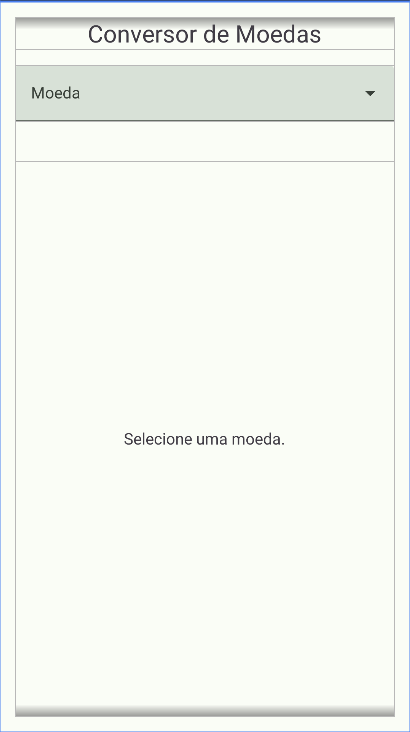

<br /></details>

<details><summary><strong>👩‍💻 Regras de implementação</strong></summary>

### Onde desenvolver

- O arquivo que você implementará o layout deve se chamar `activity_main.xml` e deve estar dentro do diretório `src/res/layout`;

### Estrutura da árvore de componentes da tela

```
App
└── ConstraintLayout
    └── LinearLayout
        ├── MaterialTextView
        ├── TextInputLayout
        │   └── AutoCompleteTextView
        ├── MaterialTextView
        └── MaterialTextView
```

### Regras de negócio

#### Componente de estado Selecione uma Moeda

- **Configuração**
  - O elemento que exibirá o texto `Selecione uma moeda.` deve ser o componente [MaterialTextView](https://developer.android.com/reference/com/google/android/material/textview/MaterialTextView)
  - Deve ser elemento filho do `LinearLayout`
  - Deve ter o id `select_currency_state`
  - O componente de estado deve estar com a visibilidade como `gone`
- **Layout**
  - Largura deve ser a mesma do elemento pai
  - Altura deve ser a mesma do elemento pai
  - Uma margem superior de `24dp`
- **Atributos**
  - O texto do componente deve ser `Selecione uma moeda.`
  - O tamanho do texto deve ser de `16sp`
  - O conteúdo do componente deve estar centralizado

### O que será testado?

- O elemento `MaterialTextView` é filho do elemento LinearLayout?
- O elemento `MaterialTextView` possui a mesma largura do elemento pai?
- O elemento `MaterialTextView` possui a mesma altura do elemento pai?
- O elemento `MaterialTextView` possui a margem superior a 24dp?
- O elemento `MaterialTextView` possui texto igual a Selecione uma moeda.?
- O elemento `MaterialTextView` tem o conteúdo centralizado?
- O elemento `MaterialTextView` possui o tamanho do texto igual a 16dp?
- O elemento `MaterialTextView` possui a visibilidade igual a GONE?

<br/></details>

## `5 - Crie o componente de estado Aguardando Resposta`

Para informar a pessoa usuária do estado da aplicação está aguardando a finalização o carregamento das moedas no componente de _Menu_, é necessário criar um componente que exiba essa informação.

<details><summary><strong>️📱 Tela</strong></summary><br />

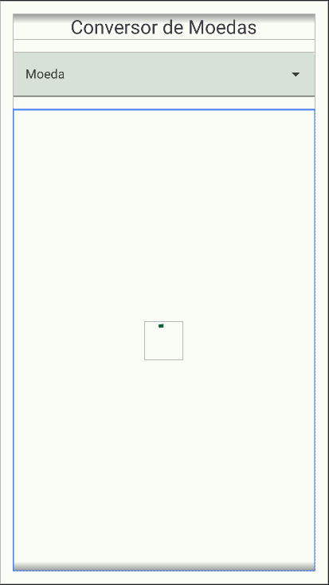

<br /></details>

<details><summary><strong>👩‍💻 Regras de implementação</strong></summary>

### Onde desenvolver

- O arquivo que você implementará o layout deve se chamar `activity_main.xml` e deve estar dentro do diretório `src/res/layout`;

### Estrutura da árvore de componentes da tela

```
App
└── ConstraintLayout
    └── LinearLayout
        ├── MaterialTextView
        ├── TextInputLayout
        │   └── AutoCompleteTextView
        ├── MaterialTextView
        ├── MaterialTextView
        └── FrameLayout
            └── CircularProgressLayout
```

### Regras de negócio

#### FrameLayout

- **Configuração**
  - Deve ser elemento filho do `LinearLayout`
  - Deve ter o id `waiting_response_state`
  - O componente de estado deve estar com a visibilidade como `gone`
- **Layout**
  - Deve ter a mesma largura do elemento pai
  - Deve ter a mesma altura do elemento pai

#### CircularProgressIndicator

- **Configuração**
  - O elemento que irá exibir uma barra de progresso circular será o componente [ProgressIndicator](https://github.com/material-components/material-components-android/blob/master/docs/components/ProgressIndicator.md#circular-progress-indicators) do tipo **circular**
  - Deve ser elemento filho do `FrameLayout`
  - Deve ter o id `waiting_response_progress`
- **Layout**
  - Deve ter a mesma largura do elemento pai
  - Deve ter a mesma altura do elemento pai
- **Atributos**
  - Deve estar centralizado horizontalmente e verticalmente em relação ao elemento pai (layout_gravity)
  - Deve estar com a propriedade `indeterminate` com valor `true`

### O que será testado?

- **FrameLayout**
  - O elemento `FrameLayout` é filho do elemento LinearLayout?
  - O elemento `FrameLayout` possui a mesma largura do elemento pai?
  - O elemento `FrameLayout` possui a mesma altura do elemento pai?
  - O elemento `FrameLayout` possui a visibilidade igual a GONE?
- **CircularProgressIndicator**
  - O elemento `CircularProgressIndicator` é filho do elemento LinearLayout?
  - O elemento `CircularProgressIndicator` possui a mesma largura do elemento pai?
  - O elemento `CircularProgressIndicator` possui a mesma altura do elemento pai?
  - O elemento `CircularProgressIndicator` está centralizado em relação ao componente pai?
  - O elemento `CircularProgressIndicator` está com a propriedade indeterminate com valor igual a true?

<br/></details>

## `6 - Crie o componente de exibição das taxas de conversão das moedas`

Após a pessoa usuária selecionar uma moeda e as informações de conversão forem carregadas, é necessário criar um componente capaz de exibir as informações das taxas de conversão das moedas em forma de lista.

<details><summary><strong>️📱 Tela</strong></summary><br />

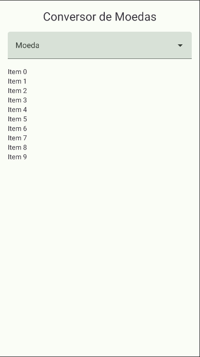

<br /></details>

<details><summary><strong>👩‍💻 Regras de implementação</strong></summary>

### Onde desenvolver

- O arquivo que você implementará o layout deve se chamar `activity_main.xml` e deve estar dentro do diretório `src/res/layout`;

### Estrutura da árvore de componentes da tela

```
App
└── ConstraintLayout
    └── LinearLayout
        ├── MaterialTextView
        ├── TextInputLayout
        │   └── AutoCompleteTextView
        ├── MaterialTextView
        ├── MaterialTextView
        ├── FrameLayout
        │   └── CircularProgressLayout
        └── RecyclerView
```

### Regras de negócio

#### RecyclerView

- **Configuração**
  - O elemento que exibirá a listagem das taxas de conversão de moedas é o componente [RecyclerView](https://developer.android.com/develop/ui/views/layout/recyclerview)
  - Deve ser elemento filho do `LinearLayout`
  - O componente deve ter o id `currency_rates_state`
  - O componente de estado deve estar com a visibilidade como `gone`
- **Layout**
  - Largura deve ser a mesma do elemento pai
  - Altura deve ser a mesma do elemento pai

### O que será testado?

- O elemento RecyclerView é filho do elemento LinearLayout?
- O elemento RecyclerView possui a mesma largura do elemento pai?
- O elemento RecyclerView possui a mesma altura do elemento pai?
- O elemento FrameLayout possui a visibilidade igual a GONE?

<br/></details>

<!-- ## `7 - Crie o componente de exibição de erro de conexão`

Para informar a pessoa usuária do estado em que a aplicação obteve um erro de conexão de rede durante uma requisição, é necessário criar um componente que exiba essa informação.

<details><summary><strong>️📱 Tela</strong></summary><br />

> Adicionar imagem nos moldes do README.md do projeto `android-0x-projeto-login-social`

<br /></details>

<details><summary><strong>👩‍💻 Regras de implementação</strong></summary>

### Onde desenvolver

- O arquivo que você implementará o layout deve se chamar `activity_main.xml` e deve estar dentro do diretório `src/res/layout`;

### Estrutura da árvore de componentes da tela

```
App
└── ConstraintLayout
    └── LinearLayout
        ├── MaterialTextView
        ├── TextInputLayout
        │   └── AutoCompleteTextView
        ├── MaterialTextView
        ├── MaterialTextView
        ├── FrameLayout
        │   └── CircularProgressLayout
        ├── RecyclerView
        └── ImageView
```

### Regras de negócio

#### Componente de estado exibir taxas de conversão

- **Configuração**
  - O elemento que exibirá uma imagem informando que ocorreu o problema de conexão utilizando o componente [ImageView](https://developer.android.com/reference/android/widget/ImageView)
  - Deve ser elemento filho do `LinearLayout`
  - O componente deve ter o id `connection_error_state`
  - A imagem a ser atribuída deve ser a que se encontra na página XPTO do **figma**.
- **Layout**
  - Largura deve ser igual a 250dp
  - Altura deve ser a mesma do elemento pai
  - Deve estar centralizado horizontalmente e verticalmente
  - Margem superior igual a 24dp
  - Margem inferior igual a 24dp
- **Atributos**
  - O componente deve estar com a visibilidade marcada como `gone`
  - O texto deve estar centralizado verticalmente e horizontalmente

### O que será testado?

- O elemento `ImageView` é filho do elemento LinearLayout?
- O elemento `ImageView` possui largura igual a 250dp?
- O elemento `ImageView` possui a mesma altura do elemento pai?
- O elemento `ImageView` está centralizado em relação ao componente pai?
- O elemento `ImageView` possui margem superior igual a 24dp?
- O elemento `ImageView` possui margem inferior igual a 24dp?
- O elemento `ImageView` possui um drawable definido?
- O elemento `ImageView` possui visibilidade igual a GONE?s

<br/></details> -->

## `7 - Criar classes que representam as respostas dos endpoints GET /symbols e GET /latest`

Para representar o JSON de resposta dos **endpoints** `GET /symbols` e `GET /latest` da API Rest [ExchangeRate](https://apilayer.com/marketplace/exchangerates_data-api), é necessário criar um conjunto de `data class` no **Kotlin** que representem a estrutura do JSON permitindo a realizar o processo de conversão do JSON em objetos **Kotlin**.

<details><summary><strong>👩‍💻 Regras de implementação</strong></summary>

Você deve implementar as duas `data classes`:

- CurrencySymbolResponse
- CurrencyRateResponse

Elas devem estar no seguinte no pacote `com.betrybe.currencyview.data.models` conforme a árvore de pacotes abaixo:

```text
app
└── java
    └── com.betrybe.currencyview
        └── data
            ├── api
            └── models
                ├── CurrencySymbolResponse
                └── CurrencyRateResponse
```

A classe `CurrencySymbolResponse` deve possuir os seguinte atributos:

- Atributo `success` do tipo **Boolean**
- Atributo `symbols` do tipo **Map<String, String>**

A classe `CurrencyRateResponse` deve possuir os seguintes atributos:

- Atributo `success` do tipo **Boolean**
- Atributo `base` do tipo **String**
- Atributo `date` do tipo **String**
- Atributo `rates` do tipo **Map<String, Double>**

### O que será testado?

- `CurrencySymbolResponse` data class
  - Existe a data class `CurrencySymbolResponse` no pacote **com.betrybe.currencyview.data.models**?
  - Existe a propriedade `success` do tipo **Boolean** na data class `CurrencySymbolResponse`?
  - Existe a propriedade `symbols` do tipo **Map<String, String>** na data class `CurrencySymbolResponse`?
- `CurrencyRateResponse` data class
  - Existe a data class `CurrencyRateResponse` no pacote **com.betrybe.currencyview.data.models**?
  - Existe a propriedade `success` do tipo **Boolean** na data class `CurrencyRateResponse`?
  - Existe a propriedade `base` do tipo **String** na data class `CurrencyRateResponse`?
  - Existe a propriedade `date` do tipo **String** na data class `CurrencyRateResponse`?
  - Existe a propriedade `rates` do tipo **Map<String, Double>** na data class `CurrencyRateResponse`?

<br/></details>

## `8 - Realizar requisição ao endpoint GET /symbols via Retrofit`

Para obter os dados dos símbolos monetários da API [ExchangeRate](https://apilayer.com/marketplace/exchangerates_data-api), é necessário criar uma `interface` com a assinatura do método que representa o **endpoint** `GET /symbols` e a anotação necessária para utilizar juntamente com o [Retrofit](https://square.github.io/retrofit/).

<details><summary><strong>👩‍💻 Regras de implementação</strong></summary>

O Objetivo deste requisito é implementar a interface `ApiService`, para realizar requisições do [Retrofit](https://square.github.io/retrofit/), dentro do pacote `com.betrybe.currencyview.data.api` conforme a árvore de pacotes abaixo.

```text
app
└── java
    └── com.betrybe.currencyview
        └── data
            └── api
                └── ApiService
```

A interface `ApiService` deve definir o método `getSymbols`, sem nenhum parâmetro de entrada e que retorne um objeto do tipo `CurrencySymbolResponse`. O método `getSymbol` deve ser marcado como `suspend`.

Para que este teste funcione corretamente, você precisará usar a classe `ApildlingResource` dentro de todas as suas `Coroutines`, como no exemplo a seguir:

``` Kotlin
CoroutineScope(Main).launch {
    try {
        // ADICIONAR ESSA LINHA
        ApiIdlingResource.increment()

        //...
        // Seu Codigo das Rotinas
        // ...

        // ADICIONAR ESSA LINHA
        ApiIdlingResource.decrement()
    } catch (e: HttpException) {
        // ADICIONAR ESSA LINHA
        ApiIdlingResource.decrement()

        //...
        // Seu Codigo de erro de HttpException
        // ...
    } catch (e: IOException) {
        // ADICIONAR ESSA LINHA
        ApiIdlingResource.decrement()

        //...
        // Seu Codigo de erro de IOException
        // ...
    }
}
```

### O que será testado?

- A Interface `ApiService` existe?
- É possível criar um cliente Rest com o Retrofit a partir da interface `ApiService`?
- O cliente Rest com Retrofit retorna uma resposta não nula?
- O cliente Rest com o Retrofit consegue realizar uma requisição e obter os valores esperados já desserializados?
- Ao iniciar o aplicativo, o componente `select` listará todas as moedas obtidas a partir da requisição à API.
- Será verificado se a moeda `BRL` está presente na resposta da requisição, e será possível selecioná-la através de um clique.

<br/></details>

## `9 - Realizar requisição ao endpoint GET /latest via Retrofit`

Para obter as últimas taxas de referência cambial da API [ExchangeRate](https://apilayer.com/marketplace/exchangerates_data-api), é necessário criar uma `interface` (caso não exista) com a assinatura do método que representa o **endpoint** `GET /latest` e a anotação necessária para utilizar juntamente com o [Retrofit](https://square.github.io/retrofit/).

<details><summary><strong>👩‍💻 Regras de implementação</strong></summary>

O Objetivo deste requisito é implementar a interface `ApiService`, para realizar requisições do [Retrofit](https://square.github.io/retrofit/), dentro do pacote `com.betrybe.currencyview.data.api` conforme a árvore de pacotes abaixo.

```text
app
└── java
    └── com.betrybe.currencyview
        └── data
            └── api
                └── ApiService
```

A interface `ApiService` deve definir o método `getLatestRates`, com um parâmetro String de entrada (`base:String`) e que retorne um objeto do tipo `CurrencyRateResponse`. O método `getLatestRates` deve ser marcado como `suspend`.

Para que este teste funcione corretamente, você precisará usar a classe `ApildlingResource` dentro de todas as suas `Coroutines`, como no exemplo a seguir:

``` Kotlin
CoroutineScope(Main).launch {
    try {
        // ADICIONAR ESSA LINHA
        ApiIdlingResource.increment()

        //...
        // Seu Codigo das Rotinas
        // ...

        // ADICIONAR ESSA LINHA
        ApiIdlingResource.decrement()
    } catch (e: HttpException) {
        // ADICIONAR ESSA LINHA
        ApiIdlingResource.decrement()

        //...
        // Seu Codigo de erro de HttpException
        // ...
    } catch (e: IOException) {
        // ADICIONAR ESSA LINHA
        ApiIdlingResource.decrement()

        //...
        // Seu Codigo de erro de IOException
        // ...
    }
}
```

### O que será testado?

- A Interface `ApiService` existe?
- É possível criar um cliente Rest com o Retrofit a partir da interface `ApiService`?
- O cliente Rest com Retrofit retorna uma resposta não nula?
- O cliente Rest com o Retrofit consegue realizar uma requisição e obter os valores esperados já desserializados?
- Ao iniciar o aplicativo, o ciclo começa no elemento `select` e permite a seleção da moeda BRL. 
- Após a seleção, o `recycle view` é carregado com as informações relacionadas a essa moeda.

<br/></details>

## `10 - Teste instrumentado: Verificar fluxo de funcionamento com conexão à Internet`

Teste instrumentado que verificará a mudança de componentes de acordo com o estado da aplicação no cenário em que o dispositivo Android possui acesso à Internet.

<details><summary><strong>👩‍💻 Regras de implementação</strong></summary>

No caso do dispositivo Android possuir acesso à Internet, a aplicativo deve transicionar entre componentes de estado durante seu funcionamento. Os componentes de estado a seguir devem ser exibidos na seguinte ordem:

Para que este teste funcione corretamente, você precisará usar a classe `ApildlingResource` dentro de todas as suas `Coroutines`, como no exemplo a seguir:

``` Kotlin
CoroutineScope(Main).launch {
    try {
        // ADICIONAR ESSA LINHA
        ApiIdlingResource.increment()

        //...
        // Seu Codigo das Rotinas
        // ...

        // ADICIONAR ESSA LINHA
        ApiIdlingResource.decrement()
    } catch (e: HttpException) {
        // ADICIONAR ESSA LINHA
        ApiIdlingResource.decrement()

        //...
        // Seu Codigo de erro de HttpException
        // ...
    } catch (e: IOException) {
        // ADICIONAR ESSA LINHA
        ApiIdlingResource.decrement()

        //...
        // Seu Codigo de erro de IOException
        // ...
    }
}
```

- **Passo 1** - Exibir o componente `load_currency_state` **(Criado no requisito 03)**

Este é o componente de estado a ser exibido na inicialização da aplicação.

Este componente exibe a mensagem `Carregando moedas...` enquanto uma requisição ao **endpoint** `GET /symbols` é realizada para popular o componente `Menu`.

Ao realizar a requisição com sucesso, o componente `load_currency_state` deve ter sua visibilidade marcada como `GONE` e exibir o próximo componente do fluxo.

- **Passo 2** - Exibir o componente `select_currency_state` **(Criado no requisito 04)**

Este componente exibe a mensagem `Selecione uma moeda.` após o preenchimento dos dados no componente `Menu`.

No momento que a pessoa usuária selecionar uma moeda no componente `Menu`, deve-se realizar uma requisição ao **endpoint** `GET /latest` passando a moeda selecionada como parâmetro de entrada e o componente `select_currency_state` deve ter sua visibilidade marcada como `GONE` e exibir o próximo componente do fluxo.

- **Passo 3** - Exibir o componente `waiting_response_state` **(Criado no requisito 05)**

Este componente exibe uma animação de carregamento de dados após durante a requisição ao **endpoint** `GET /latest`.

Quando a requisição ao **endpoint** `GET /latest` finalizar, deve-se popular o `RecyclerView` do componente `currency_rates_state` e o componente `waiting_response_state` deve ter sua visibilidade marcada como `GONE` e exibir o próximo componente do fluxo.

- **Passo 4** - Exibir o componente `currency_rates_state` **(Criado no requisito 06)**

Este componente exibe uma lista com as taxas de referência cambial da API da moeda selecionada.

Caso a pessoa usuária selecione uma nova moeda, o fluxo repete-se a partir do passo **2**.

### O que será testado?

- O elemento MaterialTextView (load_currency_state) é exibido?
- Realiza uma operação de click no componente AutoCompleteTextView
- O elemento MaterialTextView (select_currency_state) é exibido?
- Seleciona a moeda BRL no AutoCompleteTextView
- O elemento FrameLayout com o CircularProgressIndicator é exibido?
- O elemento RecyclerView é exibido?
- O elemento RecyclerView possui, no mínimo, um elemento?

<br/></details>

<!-- ## `12 - Teste instrumentado: Verificar fluxo de funcionamento sem conexão à Internet`

Teste instrumentado que verificará a mudança de componentes de acordo com o estado da aplicação no cenário em que o dispositivo Android não possui acesso à Internet.

<details><summary><strong>👩‍💻 Regras de implementação</strong></summary>

No caso do dispositivo Android não possuir acesso à Internet, a aplicativo deve transicionar entre componentes de estado durante seu funcionamento e, ao final, exibir o componente de estado que indica problema de conexão (`connection_error_state`). 

Diferente do requisito anterior, o dispositivo virtual que será utilizado para o teste não possuirá conexão com a Internet. Logo é esperado que a requisição ao **endpoint** `GET /symbols` falhe e que seja exibido o componente de estado de erro de conexão.

Para este caso, os componentes de estado a seguir devem ser exibidos na seguinte ordem:

- **Passo 1** - Exibir o componente `load_currency_state` **(Criado no requisito 03)**

Este é o componente de estado a ser exibido na inicialização da aplicação.

Este componente exibe a mensagem `Carregando moedas...` enquanto uma requisição ao **endpoint** `GET /symbols` é realizada para popular o componente `Menu`.

Ao realizar a requisição com sucesso, o componente `load_currency_state` deve ter sua visibilidade marcada como `GONE` e exibir o próximo componente do fluxo.

- **Passo 2** - Exibir o componente `connection_error_state` **(Criado no requisito 07)**

Este componente exibe uma imagem com o simbolo de _WiFi_ cortado após ser lançada uma exceção durante a requisição ao **endpoint** `GET /symbols`.

### O que será testado?

- O elemento MaterialTextView é exibido?
- O elemento ImageView é exibido?

<br/></details> -->

---

<details>
<summary><strong>🗣 Nos dê feedbacks sobre o projeto!</strong></summary><br />

Ao finalizar e submeter o projeto, não se esqueça de avaliar sua experiência preenchendo o formulário.
**Leva menos de 3 minutos!**

[Formulário de avaliação do projeto](https://be-trybe.typeform.com/to/ZTeR4IbH#cohort_hidden=CH1&template=betrybe/android-0x-projeto-android-cambio)

<br /></details>

<details>
<summary><strong>🗂 Compartilhe seu portfólio!</strong></summary><br />

Você sabia que o LinkedIn é a principal rede social profissional e compartilhar o seu aprendizado lá é muito importante para quem deseja construir uma carreira de sucesso? Compartilhe esse projeto no seu LinkedIn, marque o perfil da Trybe (@trybe) e mostre para a sua rede toda a sua evolução.

<br /></details>
