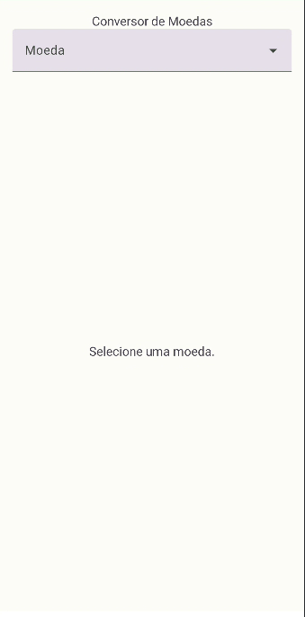
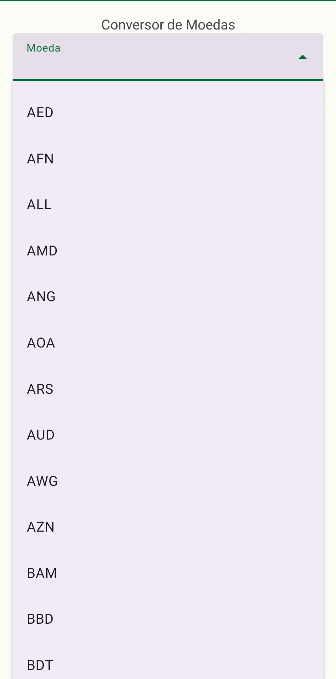
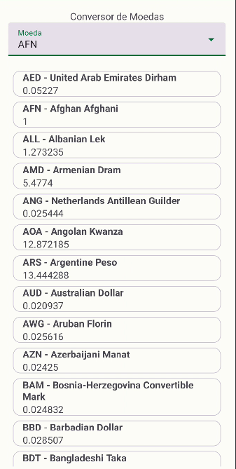

# Welcome to the project Currency Converter

This Android application allows users to convert between various currencies.

## Table of Contents
* [Features](#features)
* [Build Environment](#build-environment)
* [Dependencies](#dependencies)
* [API Key](#api-key)
* [API Documentation](#api-documentation)
* [Contact](#contact)
* [Installation and Setup](#installation-and-setup)
* [Usage](#usage)
* [Screenshots](#screenshots)

## Features
* **Comprehensive Currency List:**  Displays a menu of available currencies for selection.
* **Real-time Conversion:**  Provides instant conversions of 1 unit of the selected currency to other currencies.
* **User-friendly Interface:**  Designed for easy navigation and intuitive use.

## Build Environment
* **Kotlin:**  2.0.20
* **Target SDK:**  35
* **JVM Target:**  17

## Dependencies

* **Retrofit (2.11.0):**  For making network requests to fetch currency exchange rates.
* **Gson (2.11.0):**  For parsing JSON data from the API.
* **Kotlin Coroutines:**  For managing asynchronous operations.
* **AndroidX ViewModel:**  For managing UI state and data.
* **Dagger Hilt:** For providing dependency injection. <br>

*for a detailed list of dependencies and their versions, please refer to [DEPENDENCIES.md](docs/DEPENDENCIES.md)*

## API Key
* This app uses an external API to fetch currency exchange rates. To ensure fair usage and prevent service disruption, the API key provided has a usage limit of 100 requests per month.
* If you encounter an error message (Error: 2131685922 or timeout) indicating that the request limit has been reached, please feel free to contact me through the information provided in the [Contact](#contact) section. I will be happy to provide you with a new API key.

## API Documentation

**Exchange Rates Data**

* **Endpoints Used:**
  <br>/latest
  <br>/symbols
  <br>
* **Request Parameters:**
  <br> /symbols: only the API Key
  <br> /latest: @base (a three letter currency code of the selected currency) and the API Key
  <br>
* **Response Format:**
  <br> /symbols:
   ```json
   {
     "success": true,
     "symbols": {
       "AED": "United Arab Emirates Dirham",
       "AFN": "Afghan Afghani",
       "ALL": "Albanian Lek",
       "AMD": "Armenian Dram"
     }
   }
   ````
   <br>/latest
   ```json
  {
  "base": "USD",
  "date": "2021-03-17",
  "rates": {
    "EUR": 0.813399,
    "GBP": 0.72007,
    "JPY": 107.346001
  },
  "success": true,
  "timestamp": 1519296206
   }
   
## Contact
* **Maintainer:** Iury Ruan
* **Email:** iuryruansc@gmail.com
* Feel free to reach out if you have any questions, encounter any issues, or have suggestions for the project.

## Installation and Setup

1. **Clone the repository:**
   ```bash
   git clone https://github.com/iuryruansc/projeto-android-cambio.git

2. **Open the project in your IDE:**
   <br>Android Studio is recommended.

3. **Run the application:**
   <br>Ensure your device or emulator is running Android 7.0 or higher.
   <br>Click the "Run" button in your IDE.

## Usage

1. Launch the app. <br>
2. Select a currency from the menu. <br>
3. View the equivalent values of 1 unit of the selected currency in other currencies. <br>

## Screenshots
|  |  |  |
|:---:| :---: | :---: |
